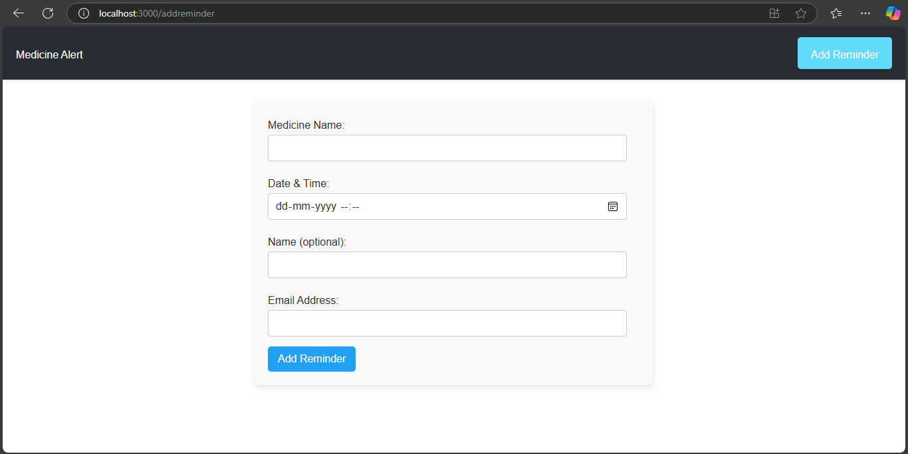
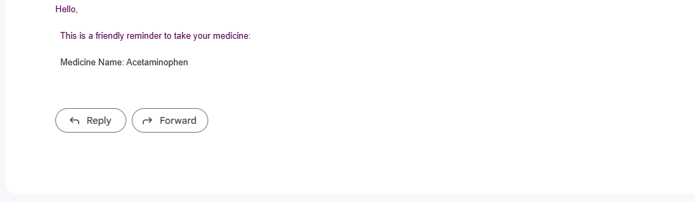

# Medicine Alert

## Overview

Medicine Alert is a MERN stack application that sends email reminders to patients for their medication schedules. 

- Caregivers can set medication reminders for patients, specifying the medicine name, reminder date and time, and patient details.

- Email reminders are sent directly to patients when it's time to take their medication, ensuring the patient never forgets their medication.

- Nodemailer is used to send email notifications to patients about medication schedules. It ensures that patients receive timely reminders when it's time to take their medication.


### Installation

1. **Clone the repository:**
   ```sh
   git clone https://github.com/Balaatchayar/Medicine-Alert
  
2. **Install backend dependencies and start**
    ```sh
    cd server
    npm install
    node index.js

3. **Install frontend dependencies and start**
    ```sh
    cd client
    npm install
    npm start

4.**Database Setup**

To connect your database, you need to update the `server/index.js` file with the appropriate MongoDB connection string.

## Environment Configuration

### Server

Create a `.env` file in the `server` directory.

Add the following variables:

   ```env
    EMAIL_USER=your-email@example.com
    EMAIL_PASS=your-email-password
   ```


### Caregivers can set medication reminders for patients, specifying the medicine name, reminder date and time, and patient details.




### Email reminders are sent directly to patients when it's time to take their medication, ensuring the patient never forgets their medication.





